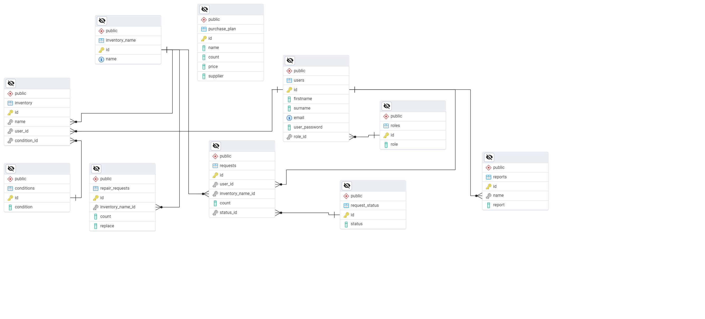

# Содержание 
- [Краткое описание](#краткое-описание)
- [Инструкция по развертыванию](#интсрукция-по-установке)

# Краткое описание
## Цель проекта
Создать сервис для эффективного учета, контроля и распределения спортивного 
инвентаря для улучшения спортивной деятельности учащихся.
## Технологии
- Python
  - Flask
  - psycopg2
- БД
  - PostgreSQL
- HTML/CSS
## Возможности продукта 
1. Для администратора
   - Авторизация
   - Просмотр существующего инвентаря
   - Редактирование/добавление инвентаря
   - Выдача инвентаря пользователям 
   - Создание отчетов по использованию инвентаря
   - Планирование закупки нового инвентаря
2. Для пользователя
   - Авторизация/регистрация
   - Просмотр существующего инвентаря
   - Запрос на получение инвентаря и отслеживание статуса запроса
   - Создание заявки о ремонте или замене инвентаря
3. Возможности для улучшения проекта
    - Добавление новых ролей
    - Поддержка интеграции с внешними системами для автоматизации закупок
    - Создание статистики по использованию инвентаря пользователями

## База данных
При создании веб приложения  была создана бд, ер-диаграмма  которой представлена ниже

# Интсрукция по установке


## 1. Установка базы данных PostgreSQL

1. Скачайте и установите PostgreSQL с [официального сайта](https://www.postgresql.org/download/).
2. Установите pgAdmin для управления базой данных.
3. В процессе установки задайте пароль для пользователя **postgres** и запомните его.

## 2. Клонирование репозитория

Склонируйте код приложения из GitHub:

```sh
git clone https://github.com/Ivlion/yandex_web.git
cd yandex_web
```

## 3. Создание базы данных

1. Откройте pgAdmin и подключитесь к серверу PostgreSQL.
2. Создайте новую базу данных с именем **yandex_web**.
3. Откройте файл `init.sql`, скопируйте его содержимое.
4. В pgAdmin откройте вкладку **Query Tool**, вставьте скопированный код и выполните запрос для создания структуры базы данных.

## 4. Настройка конфигурационного файла

1. Откройте файл `config.json`.
2. Найдите поле `password` и вставьте в него пароль, который был задан при создании базы данных.
3. Сохраните изменения.

## 5. Запуск приложения

Выполните команду:

```sh
python main.py
```

После этого приложение должно запуститься.

### Адрес веб-приложения
По умолчанию Flask запускается на `http://127.0.0.1:5000/`.

Логин администратора: root@gmail.com

Пароль: admin
